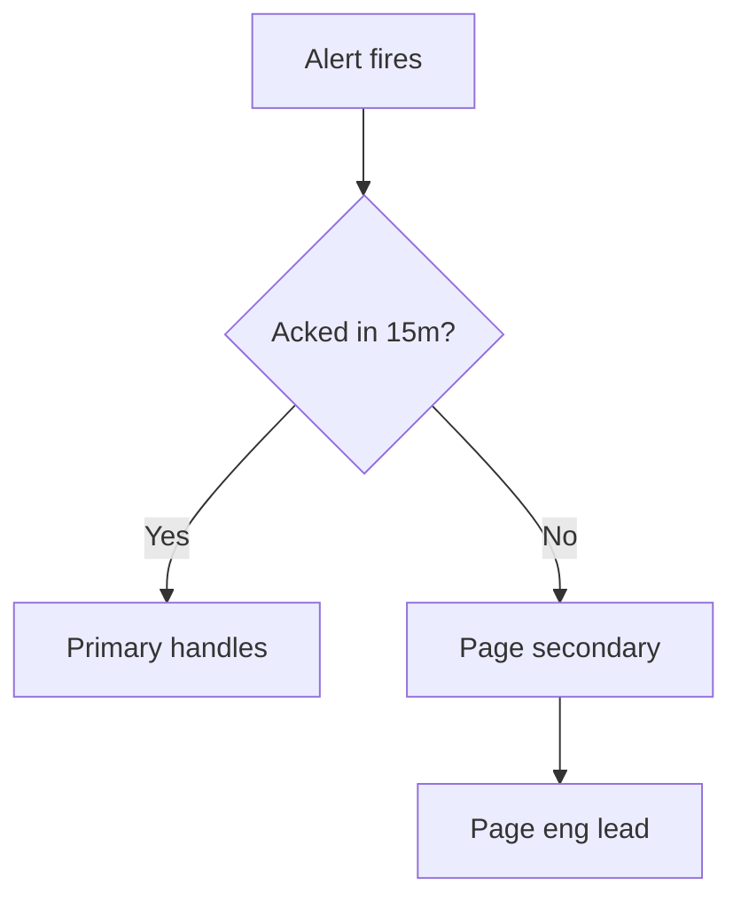

## On-call overview

<hint type="danger">
  This document is internal. Do not share the escalation contacts outside the on-call rotation.
</hint>

<ExpandableHeading>
  ## Escalation policy

  If a P0 is not acknowledged within 15 minutes, page the secondary on-call, then the engineering lead.
</ExpandableHeading>

## Severity levels

| Level | Response time     | Owner             |
| ----- | ----------------- | ----------------- |
| P0    | 15 min            | On-call primary   |
| P1    | 1 hour            | On-call secondary |
| P2    | Next business day | Team lead         |

## Incident board

<DropList data="{&#x22;columns&#x22;:[{&#x22;id&#x22;:&#x22;todo&#x22;,&#x22;name&#x22;:&#x22;Reported&#x22;,&#x22;items&#x22;:[{&#x22;id&#x22;:&#x22;i1&#x22;,&#x22;content&#x22;:&#x22;Investigate elevated 5xx on QA&#x22;,&#x22;justAdded&#x22;:false}]},{&#x22;id&#x22;:&#x22;doing&#x22;,&#x22;name&#x22;:&#x22;Mitigating&#x22;,&#x22;items&#x22;:[{&#x22;id&#x22;:&#x22;i2&#x22;,&#x22;content&#x22;:&#x22;Roll back last deploy&#x22;,&#x22;justAdded&#x22;:false}]},{&#x22;id&#x22;:&#x22;done&#x22;,&#x22;name&#x22;:&#x22;Resolved&#x22;,&#x22;items&#x22;:[]}]}">
  ```json
  {
    "columns": [
      {
        "id": "todo",
        "name": "Reported",
        "items": [
          { "id": "i1", "content": "Investigate elevated 5xx on QA", "justAdded": false }
        ]
      },
      {
        "id": "doing",
        "name": "Mitigating",
        "items": [
          { "id": "i2", "content": "Roll back last deploy", "justAdded": false }
        ]
      },
      {
        "id": "done",
        "name": "Resolved",
        "items": []
      }
    ]
  }
  ```
</DropList>

## Escalation flow


